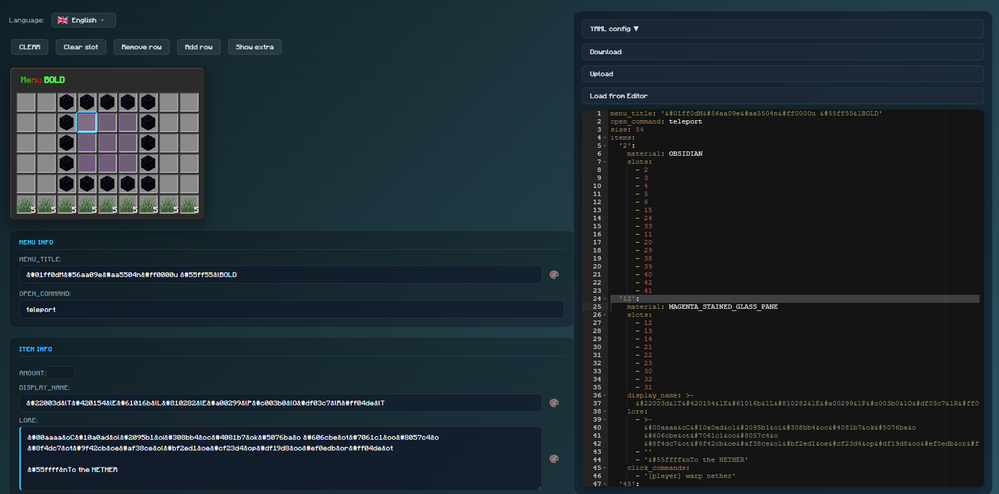
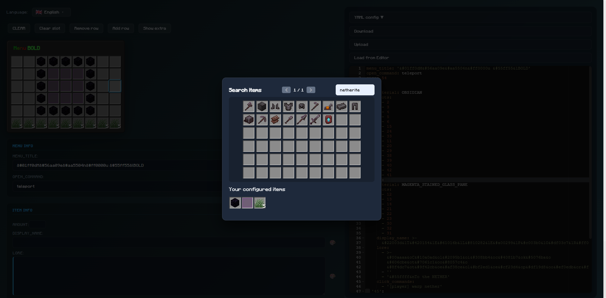
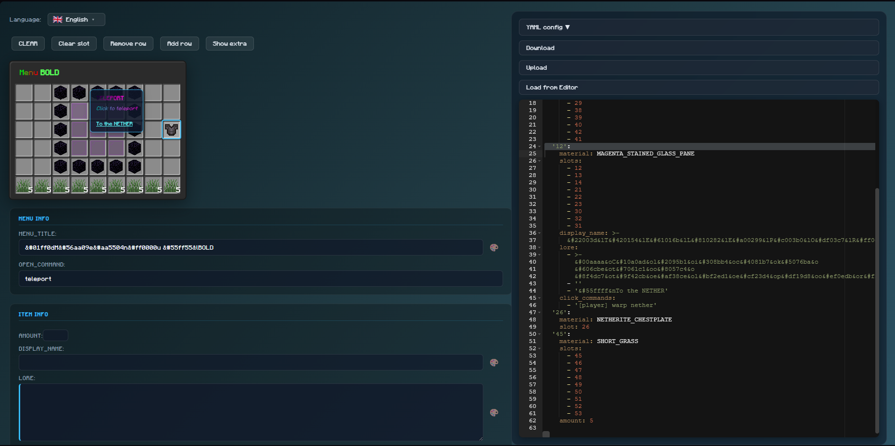
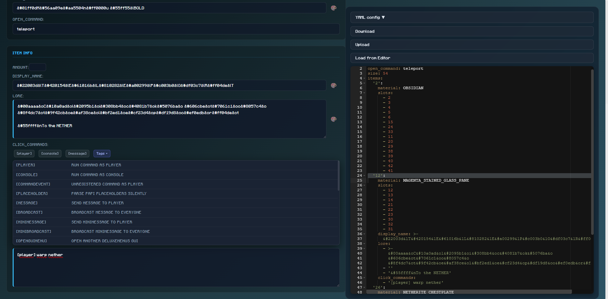
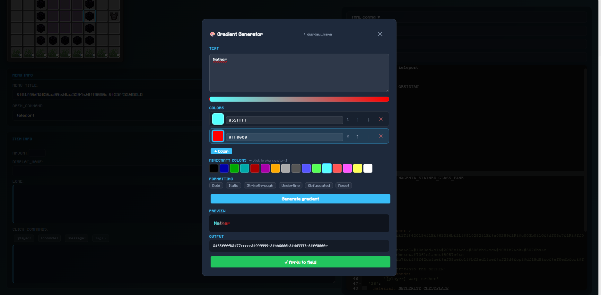

# DeluxeMenus Editor

A visual web editor for creating and maintaining [DeluxeMenus](https://www.spigotmc.org/resources/deluxemenus.11734/) menu configurations for Minecraft servers.

This project helps you build menu layouts faster with a grid-based item editor, live YAML workflow, item search, gradient text generation, and command helper tags.

## Features

- Visual inventory/grid editor for menu items
- Built-in YAML editor with load/reset workflow
- Item search and quick item assignment
- Gradient generator for display name and lore
- Command quick-actions and tag helper list for click command fields
- Multi-language UI support (8 languages)

## Screenshots

### 1. Main Editor Layout
A quick look at the overall interface and layout.



### 2. Item Search
Search and pick Minecraft items quickly.



### 3. Gradient Preview Support
Gradient preview and generation workflow for text fields.



### 4. Command Tag Help
Built-in helper list for command tags.



### 5. Color Helper for Text Fields
Color helper support for lore, display name, and menu title.



## Getting Started

### Prerequisites

- Node.js 16+
- npm

### Install

```bash
npm install
```

### Run Development Server

```bash
npm start
```

### Production Build

```bash
npm run build
```

## Deployment

The app is configured for GitHub Pages deployment:

```bash
npm run deploy
```

The production base path is set by the `homepage` value in `package.json`.

## Tech Stack

- React 16 (Create React App)
- react-ace + js-yaml
- react-modal
- react-colorful

## Credits

- Original project: [TABmk/deluxemenus-editor](https://github.com/TABmk/deluxemenus-editor)
- Fork reference: [vanhauluonsuy/deluxemenus-editor](https://github.com/vanhauluonsuy/deluxemenus-editor/)

## License

This project is provided as-is for community/server tooling use.
